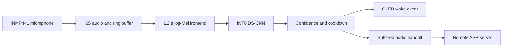

# SIH-_26172
# Kairo Edge

Low-latency custom keyword spotting for edge devices using an ESP32-S3, an INMP441 digital microphone and an integer-quantized neural network.

> **Project status:** Research prototype. The reported VASU results come from development data. The ML model has not yet been validated on the ESP32-S3, the sealed speaker set has not been opened, and the ASR handoff has not been implemented. Do not treat the current results as field accuracy or a production-ready detector.

## Problem statement

This project addresses SIH26172, **Low Latency and Efficient Voice Activator for Edge Devices**. The target system listens locally for a custom phrase. After a confirmed activation, it must send the following speech to a remote automatic speech recognition service with low delay and limited data transfer.

The SIH constraints require:

- a custom keyword model built with open-source tools;
- local execution on low-power hardware;
- less than 256 KB runtime RAM for the edge application;
- less than 10% CPU use while continuously listening;
- high keyword recall with very few false activations;
- measured delay from keyword end to audio arrival at the ASR server.

## Current prototype

The present hardware prototype uses:

| Part | Role |
|---|---|
| ESP32-S3 development board | Audio acquisition, local inference and network control |
| INMP441 | 16 kHz mono I2S audio input |
| SSD1306-class OLED | Local state and wake-event feedback |
| ESP-IDF 5.5.5 | Firmware, FreeRTOS tasks, profiling and build measurements |
| TensorFlow 2.20 | Model training and full-integer export |
| TensorFlow Lite Micro / ESP-NN | Planned ESP32-S3 inference runtime |

The current development keyword is **VASU**. It was chosen for early experimentation and is the only phrase covered by the reported model results. The project name is Kairo Edge. A future phrase such as **OK Kairo** requires a new dataset, training run and evaluation before any performance claim.

## System architecture



The wake detector and ASR serve different purposes. The ESP32-S3 decides whether the custom phrase occurred. The remote server processes the speech that follows. A bounded audio buffer is planned so the first command word is not lost while the handoff starts.

## Audio and feature pipeline

The formal V2-V4 experiments use one fixed frontend:

| Setting | Value |
|---|---:|
| Audio format | 16 kHz, mono, signed 16-bit PCM |
| Context length | 19,200 samples, or 1.2 seconds |
| Input tensor | 59 x 40 x 1 |
| Frame length | 480 samples, or 30 ms |
| Frame hop | 320 samples, or 20 ms |
| FFT size | 512 |
| Mel bands | 40 HTK bands from 80 Hz to 7,600 Hz |
| Normalization | Training-only mean and standard deviation per Mel band |
| Detector update | Every 1,600 samples, or 100 ms |

The 1.2-second frontend replaced the earlier one-second, 49 x 40 experiment. Firmware must use the constants shipped with the selected model. A model and mismatched frontend can compile successfully while producing unusable scores.

## Dataset audit

The complete audit covers 42 original WAV recordings and 46.08 minutes of audio.

| Split | Files | Duration | Use |
|---|---:|---:|---|
| Training | 20 | 1,330 s | Model fitting and augmentation |
| Development | 13 | 775 s | Model, threshold and detector selection |
| Sealed speaker | 9 | 660 s | Reserved independent evaluation |

Speakers 1-3 supplied the formal training and development material. Speaker 4 remains sealed. Speaker 5 phone recordings were not used in the reported V2-V4 results.

Human review accepted 415 keyword or confusable-word candidates and rejected 30 unclear candidates. The audit also created 1,197 one-second negative windows from background and continuous other speech. Because some development windows overlap, they must not be described as independent utterances.

The public repository should contain the audit manifests and counts, but not the raw voices or review montage WAV files unless every speaker has provided explicit consent.

## Model experiments

The table distinguishes the early single-speaker prototype from the later formal pipeline.

| Stage | Model | Model size | Keyword result | False activation result | Decision |
|---|---|---:|---:|---:|---|
| Early POC | Timing-detail CNN, 19,518 parameters | Float Keras model | 17/21 fresh targets, 80.95% | 15 events in 90 s, 10.0/min | Exposed overfitting and Kaasu confusion |
| V2 | Four-class DS-CNN, 22,924 parameters | 31,432-byte INT8 model | 65/69, 94.20% development recall | 112 events in 523.1 s, 12.85/min | Best current formal trade-off; still experimental |
| V3 | Compact binary temporal DS-CNN, 4,349 parameters | 12,720-byte INT8 model | 65/69, 94.20% development recall | 172 events in 523.1 s, 19.73/min | Memory fallback; false events increased |
| V4 | Gated three-class DS-CNN, 22,387 parameters | 34,336-byte INT8 model | 5/69, 7.25% development recall | 0 observed events | Rejected because the gate suppressed genuine keywords |

The V2 and V3 recall values do not mean 94.2% overall accuracy. The detector settings were selected using development recordings. The sealed speaker set remains untouched.

### Quantization checks

The V2 float and INT8 models agreed on 99.12% of development clip argmax predictions. Their mean score change was 0.00369. The exported V2 graph contained no float tensors, dynamic-shape operators or variable operators. The C++ model array and frontend constants passed a host compilation check.

These checks show that conversion succeeded. They do not prove the ESP32-S3 runtime RAM, CPU use, latency or real-time accuracy.

## Why V2 is the current integration candidate

V2 and V3 reached the same development keyword recall. V2 produced fewer false events. Its 31,432-byte model file is larger than V3, but model-file size does not equal tensor-arena or total runtime RAM. V2 should therefore be integrated first, while V3 remains the fallback if measured runtime memory exceeds the limit.

## Repository structure

```text
kairo-edge-voice-activator/
├── README.md
├── LICENSE                         # add after the team agrees
├── .gitignore
├── firmware/
│   └── esp32s3/                    # ESP-IDF project, added after ML integration
├── training/
│   ├── notebooks/
│   │   ├── VASU_training_v2.ipynb
│   │   ├── VASU_v3_binary_hard_negative.ipynb
│   │   └── VASU_v4_gated_confusable.ipynb
│   └── source/
│       └── vasu_pipeline.py
├── models/
│   ├── v2/                         # INT8 model and matching frontend constants
│   ├── v3/
│   └── v4/
├── evaluation/
│   ├── dataset_audit/              # CSV/JSON manifests only
│   ├── v2/
│   ├── v3/
│   └── v4/
├── docs/
│   ├── SIH_Evidence_Guide.pdf
│   └── demo_links.md
└── private_data/                   # ignored; never push raw voices
```

## Safe public release rules

Do not push the following files to a public repository:

- `vasu_kaasu_focus_*.zip`, because these archives contain raw voice recordings;
- the full dataset-audit ZIP, because it contains review montage WAV files;
- `golden_pcm_s16le.bin` or any file containing recoverable voice audio without consent;
- Wi-Fi names, passwords, tokens, private server addresses or personal email credentials;
- Speaker 4 recordings before the team freezes the detector and performs the independent test.

Safe public material includes source code, clean notebooks, non-audio manifests, result JSON files, selected CSVs, plots, model hashes, TFLite files and frontend constants. Keep a private Drive folder for raw audio.

## Reproducing the training pipeline

1. Open the clean notebook in Google Colab.
2. Use a fresh runtime and upload the private recordings ZIP plus the reviewed audit checkpoint.
3. Run the cells in order. Do not add Speaker 4 or Speaker 5 to model selection.
4. Preserve the generated `result_summary.json`, detector-search CSV, plot, model file and SHA-256 hash.
5. Compare the result with the committed evidence before replacing a model.

Training uses custom VASU recordings and no generic pre-trained wake-word model.

## ESP32-S3 integration gate

Before reporting an embedded result, the firmware must pass all of these checks:

1. Feed the reference feature tensor to TensorFlow Lite Micro and match the host INT8 output.
2. Feed the same PCM to the ESP frontend and compare all 59 x 40 features with the saved reference.
3. Run continuous I2S capture without dropped audio blocks.
4. Record inference duration, tensor arena, minimum internal heap and stack high-water marks.
5. Record listening CPU over a fixed quiet interval and state how both cores were handled.
6. Test ordinary speech, confusable words, noise, distance and multiple speakers.
7. Freeze the model and threshold before opening the sealed speaker set.

Useful build commands after the ESP-IDF project is added:

```powershell
idf.py set-target esp32s3
idf.py menuconfig
idf.py build
idf.py size
idf.py size-components
idf.py -p COMx flash monitor
```

## Measurement plan

| Metric | Instrumentation | Report |
|---|---|---|
| Model and firmware size | TFLite byte count, `idf.py size`, linker map | Bytes and KiB |
| Runtime RAM | Internal heap snapshots, minimum free heap, tensor arena, stack high-water marks | Five boots, worst case and mean |
| Listening CPU | FreeRTOS runtime-stat deltas over a fixed 60-second interval | Aggregate two-core use and per-task values |
| Inference time | `esp_timer_get_time()` around frontend and invoke | Median, mean and p95 after warm-up |
| False activations | Long continuous negative recordings | Events per hour with exposure time |
| Keyword recall | Independently annotated target events | Matched targets divided by expected targets |
| ASR handoff latency | Keyword-end timestamp and server first-audio timestamp | Median and p95 over repeated trials |

Hardware values remain **not measured** until device logs are committed.

## Evidence links

- SIH evidence guide: **[Add public Drive URL]**
- Unedited prototype demonstration: **[Add video URL]**
- Immutable result files and hashes: **[Add GitHub release URL]**

Replace these placeholders before publishing the repository or generating the final QR codes.

## References

1. Y. Zhang, N. Suda, L. Lai and V. Chandra, “Hello Edge: Keyword Spotting on Microcontrollers,” arXiv:1711.07128, 2017. <https://arxiv.org/abs/1711.07128>
2. Google AI Edge, “Post-training quantization.” <https://ai.google.dev/edge/litert/models/post_training_quantization>
3. Espressif Systems, “ESP-TFLite-Micro.” <https://github.com/espressif/esp-tflite-micro>
4. Espressif Systems, “ESP-NN.” <https://github.com/espressif/esp-nn>
5. Espressif Systems, “ESP32-S3 Series Datasheet.” <https://documentation.espressif.com/esp32_s3_datasheet_en.pdf>
6. Espressif Systems, “Heap Memory Debugging,” ESP-IDF Programming Guide. <https://docs.espressif.com/projects/esp-idf/en/stable/esp32s3/api-reference/system/heap_debug.html>
7. Espressif Systems, “Minimizing RAM Usage,” ESP-IDF Programming Guide. <https://docs.espressif.com/projects/esp-idf/en/latest/esp32s3/api-guides/performance/ram-usage.html>
8. TDK InvenSense, “INMP441 Omnidirectional Microphone with Bottom Port and I2S Digital Output,” datasheet. <https://invensense.tdk.com/wp-content/uploads/2015/02/INMP441.pdf>

## Team and licence

Developed by **Team Vanguards** for Smart India Hackathon 2026.

Add the member list only after every name and role has been confirmed. Add a code licence after the team agrees on reuse terms. Raw or derived voice data should follow a separate consent and data-use policy.

